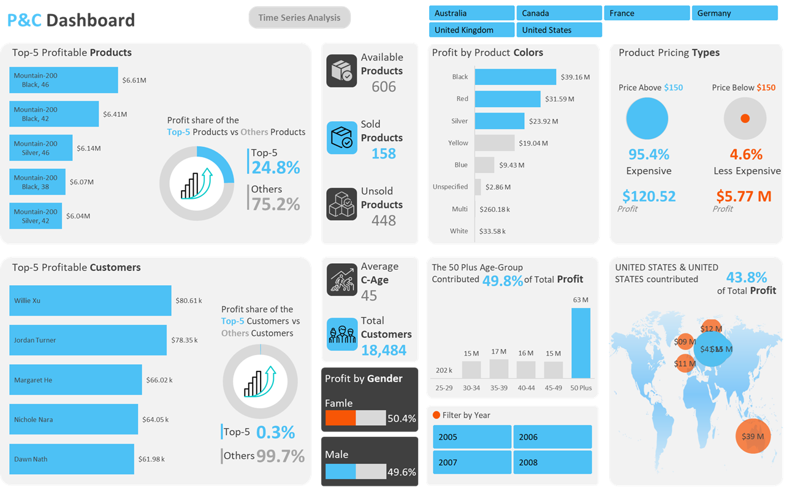

# 📊 Adventure Works Sales Analysis Dashboard

A professional interactive dashboard built using **Microsoft Excel** (Power Pivot, Power Query, PivotTables, Slicers, and Charts) to analyze sales performance for Adventure Works across different dimensions.

---

## 🚀 Overview

This project aims to deliver a comprehensive sales analysis using real-world business data from the Adventure Works dataset. The dashboard provides clear KPIs, insightful charts, and filtering options to support decision-making and trend identification.

---

## 🧠 Key Insights

- **Total Revenue:** $307M  
- **Total Profit:** $126M  
- **Profit Margin:** 41.1%  
- **Total Transactions:** 60.4K  
- **Most Profitable Quarter:** Q2 ($39.02M)  
- **72% of profit** came from weekdays  
- **66.5% of revenue** was generated during 2006–2008

---

## 🛠️ Tools & Features

- **Excel Tools:** Power Pivot, Power Query, PivotTables, Slicers, DAX, Charts
- **Techniques:** Data Cleaning, Transformation, KPI Visualization, Time-based Aggregation
- **Filters:** Year, Month, Weekday, Country, Quarter

---

## 📌 Dashboard Highlights

- Dynamic KPIs: Revenue, Profit, Transactions, Profit Margin
- Time Trends: Monthly and Quarterly performance tracking
- Profit Contribution: By country, day of the week, and quarter
- Interactive filters for flexible slicing and dicing
- Clean, modern UI design with visual hierarchy

---

## 📂 Files

- `AdventureWorks.xlsm`: Source Excel file with dynamic dashboard and data model  
- `Dashboard1.png`: Screenshot preview of the dashboard

---

## 📈 Use Cases

This dashboard can be used for:
- Executive summary reporting
- Business trend analysis
- Profit optimization strategies
- Training/learning Excel dashboard techniques

---

## 🔗 Author

**Hesham Saad** – Data Analyst  
[LinkedIn](https://www.linkedin.com/in/hesham-saad-haiba) • [Email](mailto:hesham.s.haiba@gmail.com)

---

> 📌 *“Good data visualization turns insights into action.”*
